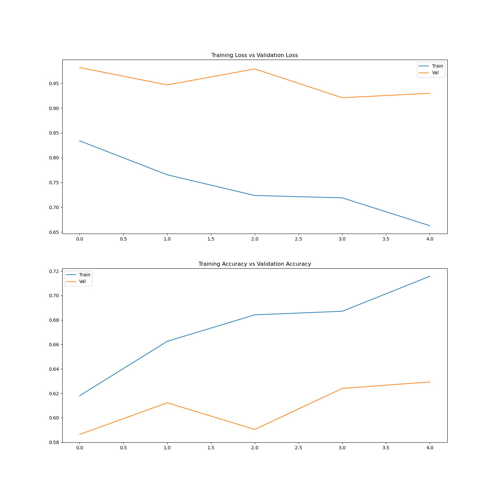
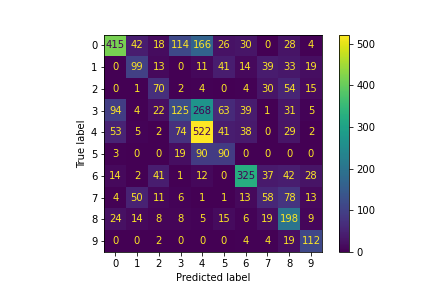
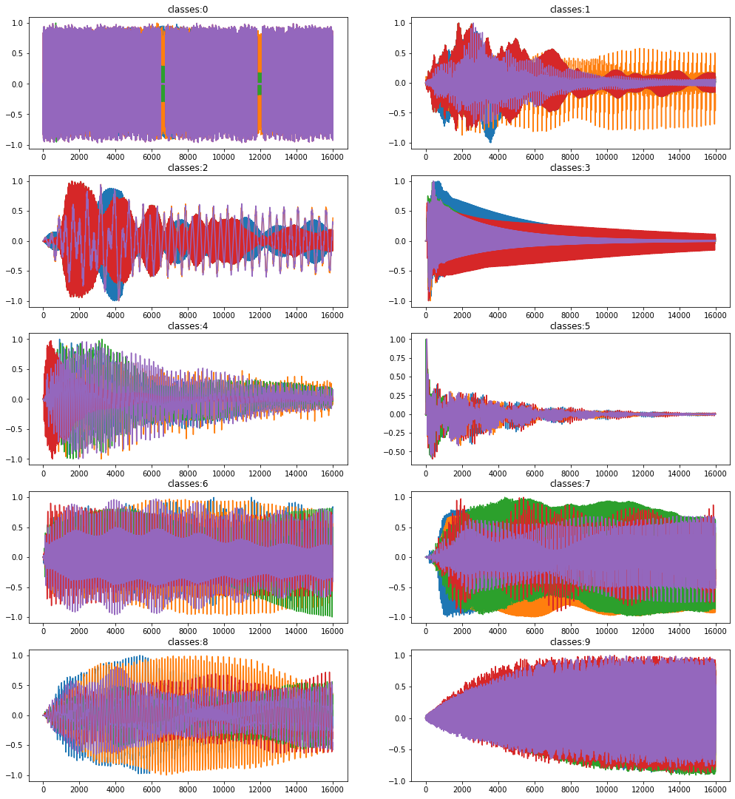

# LSTM and BLSTM on The NSynth Dataset


## About <a name = "about"></a>

RNN Audio Classification Using NSynth Data Set.


### Prerequisites and Installing

```
conda install matplotlib
conda install sklearn
conda install tensorflow
conda install notebook
```


## Usage <a name = "usage"></a>

Train the model :
```
python3 train_BLSTM.py
python3 train_LSTM.py
python3 train_bones.py
```
Test the model :
```
python3 BLSTM_predic.py
python3 Bones_predic.py
python3 LSTM_predic.py

```

## Result :




<!-- ) -->